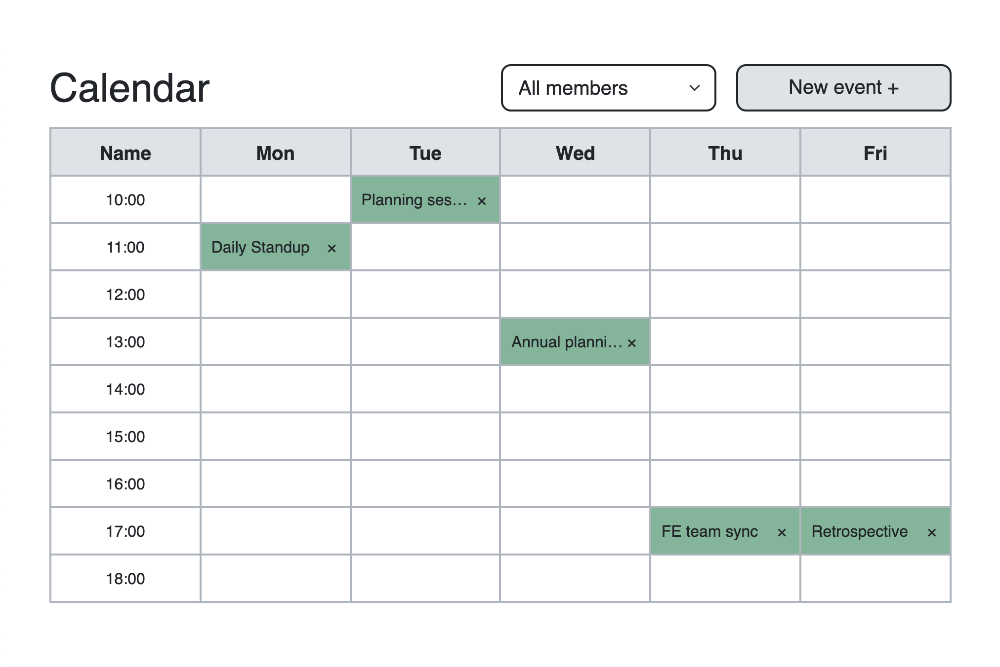

# Meeting planning calendar

## Description

This is a simple app that shows schedule of meetings. You can add new one or remove existing meeting. Also you can filter meetings by participant.

## Preview (click to open project)

[](https://zzzhyrov.github.io/meeting-planning-calendar/)

## Tech stack

- Javascript;
- SCSS;
- Bootstrap;
- Webpack;
- Lint/Prettier
- Jest

## Completed by

>**Yevhenii Zhyrov**

>- [ GitHub](https://github.com/zzzhyrov)
>- [ Linkedin](https://www.linkedin.com/in/zhyrov/)

## To start project in development mode:

```sh
$ npm install         // install the dependencies
$ npm run start       // launch 'WebpackDevServer'
```

## To build project:

```sh
$ npm run dev         // generate a 'development' build
$ npm run build       // generate a 'production' build
```

## To deploy project to GitHub Pages

```sh
$ npm run build       // generate a 'production' build
$ npm run deploy      // deploy it to 'GitHub Pages'
```
## To launch tests

```sh
$ npm run test        // start all tests one time
$ npm run test:watch  // start all tests in 'watch' mode
```